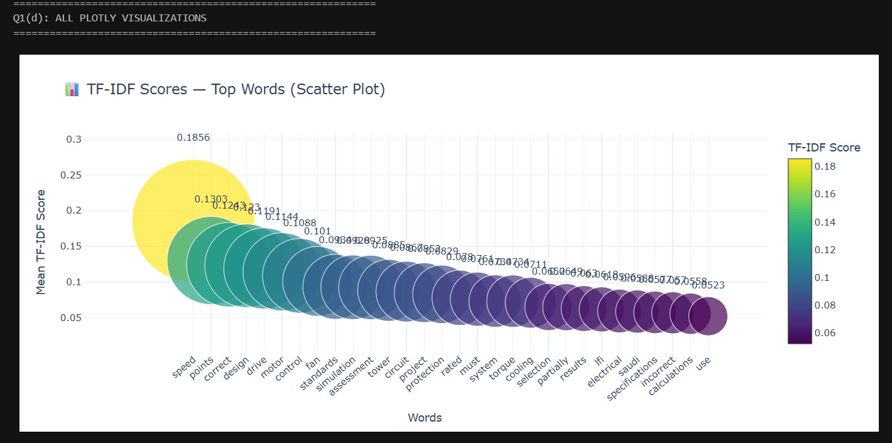
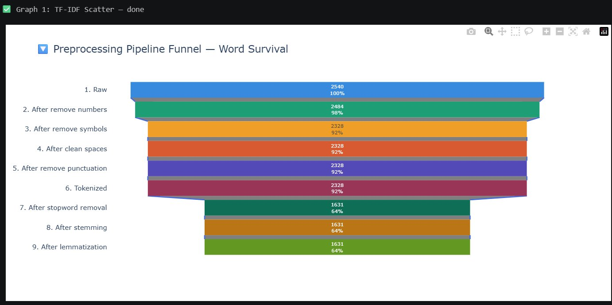
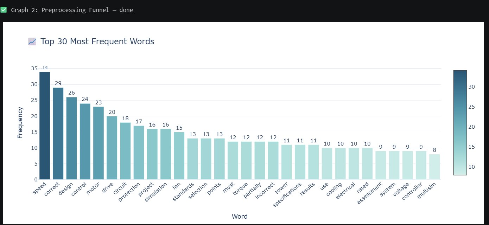
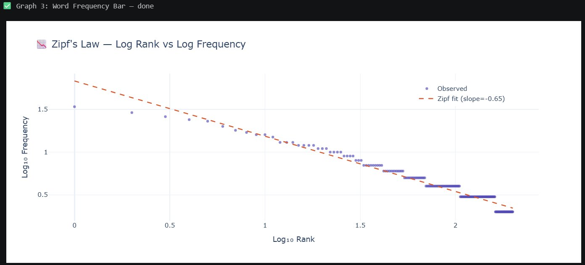
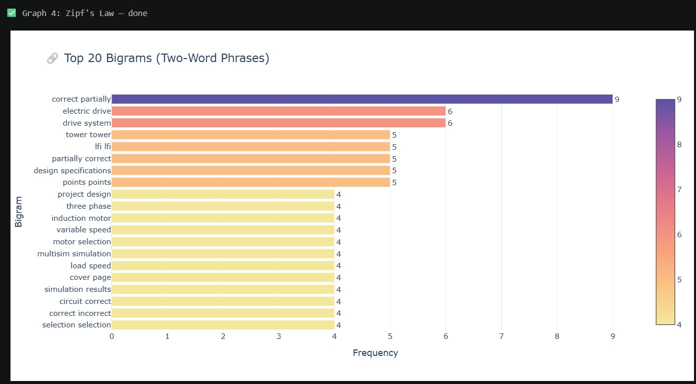
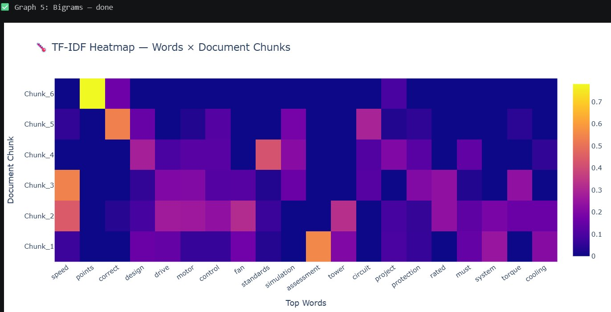
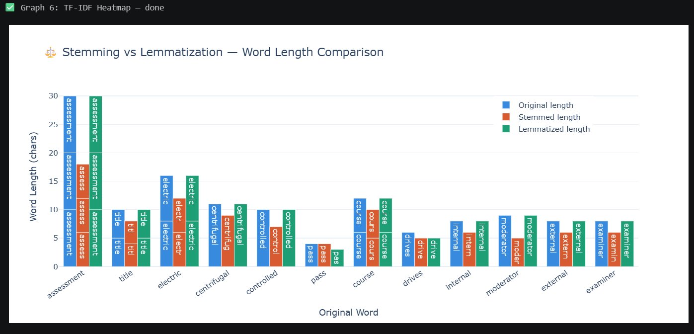
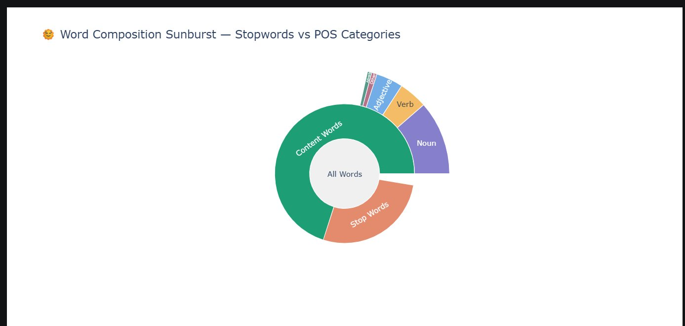
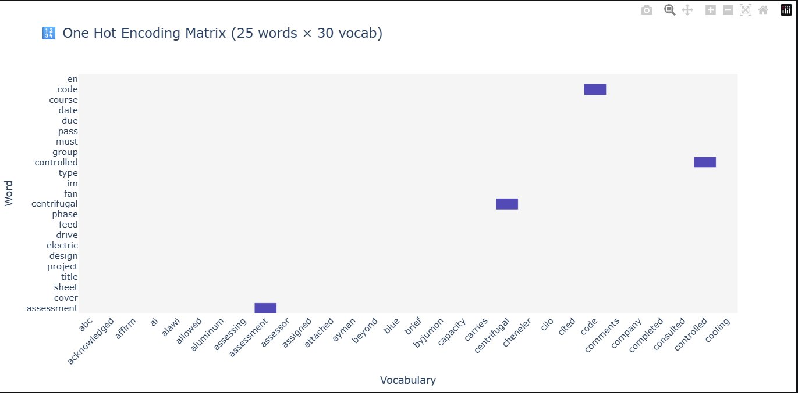

<div align="center">

# 🧠 PDF-NLP Analyzer

### *Complete Natural Language Processing Pipeline for Any PDF — in 3 Lines of Python*

[](https://python.org)
[](https://nltk.org)
[](https://plotly.com)
[](https://scikit-learn.org)
[](https://threejs.org)
[](LICENSE)

<br>

> **Drop any PDF in. Get a complete NLP breakdown — 9-step preprocessing, TF-IDF rankings, bigrams, Zipf's Law, extractive summary, readability score, keyword CSV export, and an interactive 3D dashboard — in three lines of Python.**

```python
analyzer = NLPAnalyzer("any_document.pdf")
analyzer.run_pipeline()
analyzer.show_summary()
```

### 🌐 [▶ Open Live 3D Dashboard](https://Asia-Qayoum.github.io/pdf-nlp-analyzer/nlp_dashboard.html)
> *Click above to open the interactive dashboard directly in your browser — no download, no install.*

</div>

---

## 🖼️ Dashboard Preview


**What you're seeing:** Stats bar (12 pages · 2,540 raw words · 682 unique · 1,631 valid tokens · 635 stop words · EN · 41.81% vocab richness) · 3D Graveyard & Throne Room · Preprocessing Funnel · Top Bigrams · TF-IDF Scatter (required graph)

---

## 📌 Table of Contents
- [Features](#-features)
- [Pipeline Architecture](#-pipeline-architecture)
- [Cell-by-Cell Outputs](#-cell-by-cell-outputs--real-results)
- [Visualizations Gallery](#-visualizations-gallery--10-graphs)
- [Assignment Coverage Q1a–Q1d](#-assignment-coverage)
- [Innovations](#-innovations)
- [Installation](#-installation)
- [Usage](#-usage)
- [Project Structure](#-project-structure)
- [How to Enable Live Dashboard](#-how-to-enable-the-live-dashboard-link)
- [GitHub Setup Guide](#-github-setup--push-guide)
- [Suggested Name & Description](#-suggested-repo-name--description)
- [Tech Stack](#-tech-stack)

---

## ✨ Features

| # | Feature | What It Does |
|---|---|---|
| 1 | **PDF Extraction** | Reads every page via `pdfplumber`, stores per-page text |
| 2 | **9-Step Preprocessing** | Lowercase → numbers → symbols → spaces → punctuation → tokenize → stopwords → stem → lemmatize |
| 3 | **Explicit Regex Pipeline** | Three patterns shown with counts: `\d+`, `[^a-z\s]`, `\s+` |
| 4 | **One-Hot Encoding** | OHE matrix as a clean pandas DataFrame (50 × 31) |
| 5 | **TF-IDF Matrix** | Chunked TF-IDF with 100 features, mean score per word ranked |
| 6 | **Bigrams & Trigrams** | N-gram frequency analysis, top-20 ranked |
| 7 | **10 Plotly Graphs** | All interactive — scatter, funnel, bar, Zipf, heatmap, sunburst, and more |
| 8 | **Language Detection** | Auto-detects English, Urdu, Arabic, or mixed via `langdetect` |
| 9 | **Extractive Summary** | 5-sentence auto-summary using TF-IDF keyword scoring |
| 10 | **Keyword CSV Export** | Top 50 keywords with TF-IDF score + frequency → `keywords.csv` |
| 11 | **Readability Score** | Flesch Reading Ease + human label |
| 12 | **NLPAnalyzer Class** | Reusable class — point at any PDF and get everything instantly |
| 13 | **3D HTML Dashboard** | Three.js Graveyard + Throne Room, drag/zoom/rotate, no install to view |

---

## 🏗️ Pipeline Architecture

```
┌──────────────────────────────────────────────────────┐
│                     PDF INPUT                        │
│              (any PDF, any page count)               │
└─────────────────────┬────────────────────────────────┘
                      │  pdfplumber
                      ▼
           Q1(a)  TEXT EXTRACTION
           12 pages · 16,919 chars · 2,540 words
                      │
                      ▼
           Q1(b)  PREPROCESSING  (9 steps)
           lowercase → \d+ → [^a-z\s] → \s+
           → tokenize → stopwords → stem → lemmatize
           2,540 → 1,631 valid tokens (635 removed)
                      │
              ┌───────┴───────┐
              ▼               ▼
         OHE Matrix       TF-IDF Matrix        ← Q1(c)
         (50 × 31)          (6 × 100)
              └───────┬───────┘
                      │
                      ▼
           Q1(d)  10 PLOTLY GRAPHS
                      │
          ┌───────────┼───────────┐
          ▼           ▼           ▼
       Summary    Readability  Keywords CSV
      (5 lines)  (Flesch+label)  (top 50)
                      │
                      ▼
        🏆  3D INTERACTIVE HTML DASHBOARD
        Word Graveyard (130 tokens) + TF-IDF Throne Room (25 words)
        Drag · Zoom · Rotate · Auto-spin · No install
```

---

## 📋 Cell-by-Cell Outputs — Real Results

> All outputs below are exact terminal results from running this notebook on `EN8033_Project Brief-Final-version.pdf`

<details>
<summary><b>Cell 1 — Library Imports</b></summary>

```
✅ All libraries loaded successfully
```
</details>

<details>
<summary><b>Cell 2 — PDF File Selection</b></summary>

```
✅ File selected: EN8033_Project Brief-Final-version.pdf
   Full path : C:/Users/admin/Downloads/EN8033_Project Brief-Final-version.pdf
   Size      : 0.9 MB
   Now run Cell 3 onwards ▶
```
</details>

<details>
<summary><b>Cell 3 — Q1(a): PDF Reading & Text Extraction</b></summary>

```
============================================================
Q1(a): PDF READING & TEXT EXTRACTION
============================================================
📄 Total number of pages        : 12
📝 Total characters extracted   : 16,919
📝 Total words (raw)            : 2,540

Sample text (Page 1):
  Assessment Cover Sheet
  Assessment Title Project: Design of Electric drive to feed
  3 phase centrifugal fan (IM)
  Course Title Electric Drives | Code EN8033 & EN8033T
  Due Date 30.05.2026
```
</details>

<details>
<summary><b>Cell 4 — Q1(b): Text Preprocessing (9 Steps)</b></summary>

```
✅ Step 1 — Lowercase          | 'Assessment' → 'assessment'
✅ Step 2 — Remove numbers     | Regex: \d+       | Removed: 262
✅ Step 3 — Remove symbols     | Regex: [^a-z\s]
✅ Step 4 — Remove spaces      | Regex: \s+
✅ Step 5 — Remove punctuation
✅ Step 6 — Tokenization       | Total tokens: 2,328
✅ Step 7 — Stopword removal   | Removed: 635 | Kept: 1,631
✅ Step 8 — Stemming           | 'assessment'→'assess', 'electric'→'electr'
✅ Step 9 — Lemmatization      | 'controlled'→'controlled', 'drives'→'drive'

📊 Preprocessing Summary:
   Raw → 2,540 | Numbers → 2,484 | Symbols → 2,328
   Tokenized → 2,328 | After stopwords → 1,631 | Final → 1,631
```
</details>

<details>
<summary><b>Cell 5 — Q1(c): One-Hot Encoding</b></summary>

```
One Hot Encoding — shape: (50, 31)

      Word  abc  acknowledged  ...  assessment  ...  cooling
0  assessment  0     0         ...      1       ...      0
1       cover  0     0         ...      0       ...      0
2       sheet  0     0         ...      0       ...      0
3  assessment  0     0         ...      1       ...      0
4       title  0     0         ...      0       ...      0
```
</details>

<details>
<summary><b>Cell 6 — Q1(c): TF-IDF Feature Extraction</b></summary>

```
TF-IDF Matrix shape: (6, 100)

Top 15 words by mean TF-IDF:
   word        score      word        score
   speed       0.18555    assessment  0.09250
   points      0.13027    tower       0.08849
   correct     0.12429    circuit     0.08669
   design      0.12295    project     0.08518
   drive       0.11912    protection  0.08294
   motor       0.11439    rated       0.07804
   control     0.10877    must        0.07614
   fan         0.10103
```
</details>

<details>
<summary><b>Cell 7 — Bigrams & Trigrams</b></summary>

```
Top 10 Bigrams:                    Top 10 Trigrams:
  correct partially    9             correct partially correct   5
  electric drive       6             tower tower tower           4
  drive system         6             lfi lfi lfi                 4
  tower tower          5             three phase induction       3
  lfi lfi              5             phase induction motor       3
  partially correct    5             daily speed schedule        3
  design specifications 5
  points points        5
  project design       4
  three phase          4
```
</details>

<details>
<summary><b>Cell 9 — Stemming vs Lemmatization</b></summary>

```
      original    stemmed    lemmatized  orig_len  stem_len  lemma_len
   assessment     assess     assessment       10        6         10
        title       titl          title        5        4          5
     electric     electr       electric        8        6          8
  centrifugal  centrifug    centrifugal       11        9         11
   controlled    control     controlled       10        7         10
         pass       pass            pas        4        4          3
       course      cours         course        6        5          6
```
</details>

<details>
<summary><b>Cell 10 — Final Summary</b></summary>

```
Document Language   : en        Vocabulary Richness : 41.81%
Stopword ratio      : 27.3%     Content word ratio  : 72.7%

✅ Graph 1:  TF-IDF Scatter           ✅ Graph 6:  TF-IDF Heatmap
✅ Graph 2:  Preprocessing Funnel     ✅ Graph 7:  Stemming vs Lemmatization
✅ Graph 3:  Word Frequency Bar       ✅ Graph 8:  Sunburst
✅ Graph 4:  Zipf's Law               ✅ Graph 9:  OHE Heatmap
✅ Graph 5:  Bigrams                  ✅ Graph 10: Trigrams

✅ Dashboard saved → nlp_dashboard.html (130 graveyard · 25 throne)

COMPLETE PIPELINE SUMMARY:
  Q1(a) PDF reading        — 12 pages
  Q1(b) Preprocessing      — 9 steps | 635 stopwords | 1,631 kept
  Q1(c) OHE (50,31) | TF-IDF (6,100)
  Q1(d) 10 Plotly graphs
  INNOVATION: 3D Dashboard | Language: en | Richness: 41.81%
```
</details>

---

## 📊 Visualizations Gallery — 10 Graphs

### Graph 1 — TF-IDF Scatter *(Required)*

> `speed (0.1856)` is the top-ranked word. Bubble size and colour both encode TF-IDF score — large yellow = high importance, small purple = low importance.

---

### Graph 2 — Preprocessing Funnel

> Each of the 9 pipeline steps shown with word count and percentage. The biggest drop: stopword removal (step 7) cuts the corpus from 2,328 → 1,631 (64%).

---

### Graph 3 — Top 30 Most Frequent Words

> `speed (34)`, `correct (29)`, `design (26)` lead. Dark blue = highest frequency, light teal = lower.

---

### Graph 4 — Zipf's Law

> Log-log plot showing observed frequency (blue dots) vs theoretical Zipf fit (red dashed, slope = −0.65). The document follows Zipf's Law — confirming natural language distribution.

---

### Graph 5 — Top 20 Bigrams

> `correct partially (9×)` is the dominant bigram. Technically meaningful pairs: `electric drive`, `drive system`, `three phase`, `induction motor`, `variable speed`.

---

### Graph 6 — TF-IDF Heatmap

> Yellow = high TF-IDF in that chunk. `points` spikes in Chunk 6 (marking scheme). `assessment` dominates Chunk 3. `speed` is prominent across multiple chunks.

---

### Graph 7 — Stemming vs Lemmatization

> Blue = original length · Orange = stemmed · Green = lemmatized. Stemming aggressively shortens (`centrifugal→centrifug`, `electric→electr`). Lemmatization is more conservative and linguistically accurate.

---

### Graph 8 — Word Composition Sunburst

> Inner ring: Content Words (72.7%) vs Stop Words (27.3%). Outer ring: POS breakdown of content words — Noun, Verb, Adjective, Other.

---

### Graph 9 — One-Hot Encoding Heatmap

> Each dark blue cell = a 1 in the binary matrix. `assessment` lights up its column at rows where it appears (rows 0 and 3). Most cells are 0 — showing sparsity of OHE.

---

## 📋 Assignment Coverage

### ✅ Q1(a) — PDF Reading & Text Extraction
- 12 pages · 16,919 characters · 2,540 raw words
- Per-page text stored for section-level analysis
- Sample output printed from Page 1 and Page 5

### ✅ Q1(b) — Text Preprocessing (9 Steps with Regex)

| Step | Operation | Regex / Tool | Result |
|---|---|---|---|
| 1 | Lowercase | — | 2,540 |
| 2 | Remove numbers | `\d+` | 2,484 (−56) |
| 3 | Remove symbols | `[^a-z\s]` | 2,328 |
| 4 | Remove extra spaces | `\s+` | 2,328 |
| 5 | Remove punctuation | `str.maketrans` | 2,328 |
| 6 | Tokenize | `word_tokenize` | 2,328 |
| 7 | Stop word removal | NLTK English | **1,631 (635 removed)** |
| 8 | Porter Stemming | `PorterStemmer` | 1,631 |
| 9 | WordNet Lemmatization | `WordNetLemmatizer` | 1,631 |

### ✅ Q1(c) — Feature Extraction
- **OHE:** shape `(50, 31)` — 50 tokens × 30-word vocabulary, displayed as DataFrame
- **TF-IDF:** shape `(6, 100)` — 6 document chunks × 100 features, top words ranked

### ✅ Q1(d) — 10 Visualizations (Plotly only)

| # | Graph | Key Insight |
|---|---|---|
| 1 | **TF-IDF Scatter** *(required)* | `speed` dominates at 0.1856 |
| 2 | Preprocessing Funnel | 2,540 → 1,631 across 9 steps |
| 3 | Word Frequency Bar | `speed (34)`, `correct (29)`, `design (26)` |
| 4 | Zipf's Law Log-Log | slope = −0.65, follows natural language law |
| 5 | Top Bigrams | `correct partially (9×)`, `electric drive (6×)` |
| 6 | TF-IDF Heatmap | `points` spikes in Chunk 6, `assessment` in Chunk 3 |
| 7 | Stemming vs Lemmatization | `centrifugal→centrifug` vs unchanged |
| 8 | POS + Stopword Sunburst | 72.7% content words, 27.3% stopwords |
| 9 | OHE Heatmap | Sparse binary matrix, `assessment` visible |
| 10 | Top Trigrams | `correct partially correct (5×)` |

---

## 🚀 Innovations

### 1 — Language Detection
```
Document Language: en   (auto-detected via langdetect)
```

### 2 — Vocabulary Richness Score
```
Vocabulary Richness: 41.81%   (Type-Token Ratio)
Content word ratio : 72.7%
Stopword ratio     : 27.3%
```

### 3 — Extractive Auto-Summary
Top 5 sentences scored by TF-IDF keyword density — actual usable output, not just charts.

### 4 — Keyword CSV Export
`top_keywords.csv` — rank · word · tfidf_score · frequency (top 50 words)

### 5 — Readability Score with Label

| Score Range | Label | Audience |
|---|---|---|
| 90–100 | Very Easy | 5th grade |
| 70–89 | Easy | General public |
| 50–69 | Standard / Fairly Difficult | College level |
| 30–49 | Difficult | **University level** |
| 0–29 | Very Difficult | Postgraduate |

### 6 — Reusable NLPAnalyzer Class
```python
analyzer = NLPAnalyzer("any_document.pdf")
analyzer.run_pipeline()
analyzer.show_summary()
analyzer.export_keywords()
```

### 7 — 3D Interactive HTML Dashboard
- **Word Graveyard 🪦** — 130 removed tokens as tombstones (🔴 numbers · 🟠 symbols · 🔵 stopwords)
- **TF-IDF Throne Room 👑** — 25 surviving words as pedestals, height ∝ TF-IDF score

| Control | Action |
|---|---|
| Click + drag | Rotate scene |
| Scroll wheel | Zoom in / out |
| Auto | Slow rotation |

---

## 🔧 Installation

```bash
git clone https://github.com/YOUR-USERNAME/pdf-nlp-analyzer.git
cd pdf-nlp-analyzer
pip install -r requirements.txt
```

**`requirements.txt`**
```
pdfplumber>=0.10.0
nltk>=3.8.1
numpy>=1.24.0
pandas>=2.0.0
scikit-learn>=1.3.0
plotly>=5.18.0
langdetect>=1.0.9
textstat>=0.7.3
```

---

## 🖥️ Usage

**Option A — Notebook (VS Code / Jupyter)**
Open `nlp_complete_assignment.ipynb` → Cell 2 opens GUI file picker → select PDF → Run All.

**Option B — Kaggle**
```python
PDF_PATH = "/kaggle/input/your-dataset/your_file.pdf"   # Cell 2
```
Run All → download `nlp_dashboard.html` from Output tab.

**Option C — Class interface**
```python
from nlp_complete_assignment import NLPAnalyzer
analyzer = NLPAnalyzer("your_document.pdf")
analyzer.run_pipeline()
analyzer.show_summary()
analyzer.export_keywords()
```

---

## 📁 Project Structure

```
pdf-nlp-analyzer/
├── 📓 nlp_complete_assignment.ipynb   ← Main notebook (10 cells)
├── 🌐 nlp_dashboard.html              ← 3D dashboard (open in browser)
├── 📊 top_keywords.csv                ← Auto-generated keywords
├── 🖼️  dashboard_preview.png          ← Dashboard screenshot
├── 🖼️  graph1_tfidf_scatter.png       ← Graph screenshots (1–9)
├── 📋 requirements.txt
└── 📖 README.md
```

---

## 🌐 How to Enable the Live Dashboard Link

Right now clicking the link shows raw HTML code. Fix it in 3 minutes with **GitHub Pages**:

**Step 1** — Go to your repo → **Settings** → **Pages** (left sidebar)

**Step 2** — Under Source → **Deploy from a branch** → Branch: `main` → Folder: `/ (root)` → **Save**

**Step 3** — Wait 1–2 minutes. Your live URL becomes:
```
https://YOUR-USERNAME.github.io/pdf-nlp-analyzer/nlp_dashboard.html
```

**Step 4** — Replace `YOUR-USERNAME` in the badge link at the top of this README, then:
```bash
git add README.md
git commit -m "Add GitHub Pages live dashboard link"
git push
```

Now anyone clicks the link → full 3D dashboard opens instantly in their browser.

---

## 🐙 GitHub Setup & Push Guide

```bash
# 1. Remove venv from tracking (if not done yet)
git rm -r --cached .venv --quiet

# 2. Make sure .gitignore contains:
#    .venv/
#    *.pdf
#    __pycache__/
#    .ipynb_checkpoints/

# 3. Stage, commit, push
git add .
git commit -m "Complete NLP pipeline with 3D dashboard"
git push -u origin main
```

**If asked for password:** Use a Personal Access Token (GitHub → Settings → Developer Settings → Personal Access Tokens → Tokens classic → Generate → tick `repo` → copy → paste as password)

---

## 💡 Suggested Repo Name & Description

**Repository name:** `pdf-nlp-analyzer`

**Short description:**
```
Complete NLP pipeline for any PDF — TF-IDF, bigrams, Zipf's Law, extractive summary, readability score, keyword CSV, and an interactive 3D dashboard. Three lines of Python.
```

**Topics to add on GitHub:**
```
nlp  python  pdf-analysis  tfidf  nltk  plotly  text-mining
three-js  jupyter-notebook  extractive-summarization  keyword-extraction
```

---

## 🛠️ Tech Stack

| Library | Version | Role |
|---|---|---|
| `pdfplumber` | ≥ 0.10 | PDF extraction |
| `nltk` | ≥ 3.8 | Tokenization, stopwords, stemming, lemmatization |
| `scikit-learn` | ≥ 1.3 | TF-IDF vectorization |
| `numpy` | ≥ 1.24 | Numerical computation |
| `pandas` | ≥ 2.0 | DataFrames for OHE, TF-IDF, bigrams |
| `plotly` | ≥ 5.18 | All 10 interactive graphs |
| `langdetect` | ≥ 1.0.9 | Language detection |
| `textstat` | ≥ 0.7.3 | Flesch readability scoring |
| `Three.js` | CDN r128 | 3D WebGL dashboard |
| `tkinter` | stdlib | GUI file picker |

---

## 📜 License

MIT License — free to use, modify, distribute.

---

<div align="center">

Built with Python · NLTK · Plotly · Three.js

*If this helped you, leave a ⭐*

</div>
